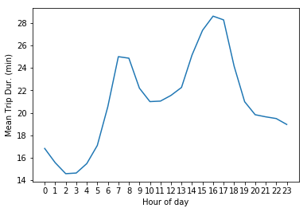
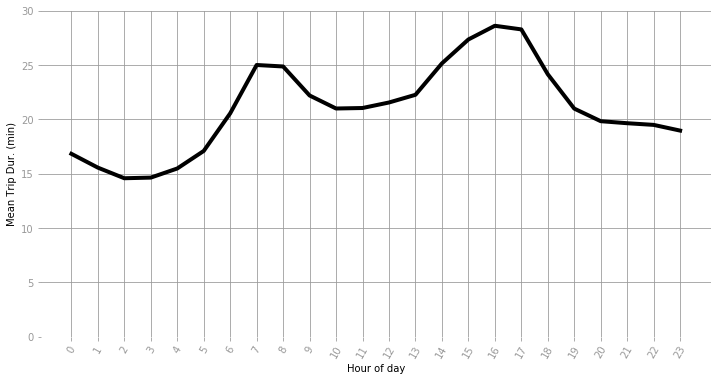

```python
import pandas as pd
import numpy as np
import matplotlib.pyplot as plt

#first regression library, statsmodels
import statsmodels.api as sm

#second regression library, sci-kit-learn
import sklearn
from sklearn.linear_model import LinearRegression
import scipy.stats as stats


```

# Importing data & prepping


```python
# Importing the uber data
filename = "Data/boston-censustracts-2018-3-OnlyWeekdays-HourlyAggregate.csv"
table = pd.read_csv(filename)

# Getting a look at the new table
print(table.head())
```

       sourceid  dstid  hod  mean_travel_time  standard_deviation_travel_time  \
    0         3      5   20            987.60                          355.46   
    1         5      3    0           1014.14                          197.06   
    2         5      3   16           1665.80                          381.10   
    3         1     12    2            180.04                          109.52   
    4         1     12   18            278.22                          192.63   
    
       geometric_mean_travel_time  geometric_standard_deviation_travel_time  
    0                      933.95                                      1.38  
    1                      996.06                                      1.21  
    2                     1621.42                                      1.26  
    3                      158.66                                      1.59  
    4                      219.43                                      2.13  


### Generating variables


```python
# Create "pairs" row, essentially an id for the trip in question
table['pair'] = table.apply(lambda row: str(int(row['sourceid']))+'-'+str(int(row['dstid'])),axis=1).head()

print(table.head())
```

       sourceid  dstid  hod  mean_travel_time  standard_deviation_travel_time  \
    0         3      5   20            987.60                          355.46   
    1         5      3    0           1014.14                          197.06   
    2         5      3   16           1665.80                          381.10   
    3         1     12    2            180.04                          109.52   
    4         1     12   18            278.22                          192.63   
    
       geometric_mean_travel_time  geometric_standard_deviation_travel_time  pair  
    0                      933.95                                      1.38   3-5  
    1                      996.06                                      1.21   5-3  
    2                     1621.42                                      1.26   5-3  
    3                      158.66                                      1.59  1-12  
    4                      219.43                                      2.13  1-12  


```python
# Creating the dummy variables for hour of day, to see the distinct effect of that particular hour on mean_travel_time
for x in np.nditer(table["hod"].unique()):
    table.loc[table.hod == int(x), (str(x)+"hr")] = int(1)
    table.loc[table.hod != int(x), (str(x)+"hr")] = int(0)
```

**Side note:** even though'hod' is a continuous variable, we're not trying to predice the marginal effect of a one unit increase in the hour of the day, but rather the effect that any given hour has on travel time: Essentially, we want to treat the time as a categorical variable. So, we need to dummy out all the hours of the day.

# Regressions
Dependent: 'mean_travel_time'

Independent: 'hod', dummied out into 24 binary variables
    
## Using Statsmodels


```python
# Adding an intercept column, to be assigned a single coeffecient by the model
table['Intercept'] = 1.0

# Statsmodels takes the DV and its IVs as Dataframes
DV = table["mean_travel_time"] # also the Y
IV = table[[
    'Intercept', '1hr','2hr','3hr','4hr','5hr','6hr','7hr','8hr','9hr','10hr',
    '11hr','12hr','13hr', '14hr','15hr','16hr','17hr','18hr','19hr','20hr',
    '21hr','22hr','23hr'
]] # also the X's

model = sm.OLS(DV,IV).fit()

print(model.summary())

```

                                OLS Regression Results                            
    ==============================================================================
    Dep. Variable:       mean_travel_time   R-squared:                       0.105
    Model:                            OLS   Adj. R-squared:                  0.105
    Method:                 Least Squares   F-statistic:                 1.964e+04
    Date:                Sun, 02 Jun 2019   Prob (F-statistic):               0.00
    Time:                        15:57:09   Log-Likelihood:            -3.0643e+07
    No. Observations:             3860011   AIC:                         6.129e+07
    Df Residuals:                 3859987   BIC:                         6.129e+07
    Df Model:                          23                                         
    Covariance Type:            nonrobust                                         
    ==============================================================================
                     coef    std err          t      P>|t|      [0.025      0.975]
    ------------------------------------------------------------------------------
    Intercept   1009.6124      1.793    563.007      0.000    1006.098    1013.127
    1hr          -76.1807      2.666    -28.572      0.000     -81.407     -70.955
    2hr         -134.7989      2.837    -47.518      0.000    -140.359    -129.239
    3hr         -131.2980      2.913    -45.072      0.000    -137.008    -125.588
    4hr          -81.0063      2.827    -28.653      0.000     -86.547     -75.465
    5hr           15.8071      2.670      5.921      0.000      10.575      21.039
    6hr          223.2545      2.516     88.730      0.000     218.323     228.186
    7hr          490.1633      2.433    201.490      0.000     485.395     494.931
    8hr          482.0258      2.421    199.103      0.000     477.281     486.771
    9hr          321.9790      2.417    133.241      0.000     317.243     326.715
    10hr         250.0731      2.431    102.856      0.000     245.308     254.838
    11hr         252.8364      2.431    104.011      0.000     248.072     257.601
    12hr         283.2487      2.418    117.128      0.000     278.509     287.988
    13hr         325.6525      2.414    134.888      0.000     320.921     330.384
    14hr         498.9863      2.389    208.853      0.000     494.304     503.669
    15hr         630.9961      2.373    265.897      0.000     626.345     635.647
    16hr         706.6043      2.368    298.366      0.000     701.963     711.246
    17hr         686.6245      2.373    289.347      0.000     681.973     691.275
    18hr         439.1928      2.377    184.782      0.000     434.534     443.851
    19hr         249.5451      2.392    104.329      0.000     244.857     254.233
    20hr         180.1101      2.407     74.840      0.000     175.393     184.827
    21hr         168.8591      2.401     70.343      0.000     164.154     173.564
    22hr         159.6535      2.405     66.393      0.000     154.940     164.367
    23hr         128.1261      2.424     52.857      0.000     123.375     132.877
    ==============================================================================
    Omnibus:                   807406.126   Durbin-Watson:                   1.831
    Prob(Omnibus):                  0.000   Jarque-Bera (JB):          2510663.910
    Skew:                           1.076   Prob(JB):                         0.00
    Kurtosis:                       6.313   Cond. No.                         26.5
    ==============================================================================
    
    Warnings:
    [1] Standard Errors assume that the covariance matrix of the errors is correctly specified.


#### Notes
- When all 24 dummy variables are included, the values soar and become unintelligible (getting -1.4e10 as the coffecient for all variables, and +1.4e10. As I understand it, this is because there's no baseline to compare against, e.g. there's no "when all treatments are absent we get __\". Removing the '0hr' dummy means that when all the other controls are 0.0, 0hr is necessarily 1.0, and midnight is the default case, absent all other hours.

## Using Sci-Kit Learn


```python
# Creating the model
lm = LinearRegression() # creating a sklearn linear model

DV = table["mean_travel_time"] # the Y
IV = table[[
    '1hr','2hr','3hr','4hr','5hr','6hr','7hr','8hr','9hr','10hr',
    '11hr','12hr','13hr', '14hr','15hr','16hr','17hr','18hr','19hr','20hr',
    '21hr','22hr','23hr'
]] # all the X's

lm.fit(IV,DV)
```

    /Library/Frameworks/Python.framework/Versions/3.6/lib/python3.6/site-packages/sklearn/linear_model/base.py:509: RuntimeWarning: internal gelsd driver lwork query error, required iwork dimension not returned. This is likely the result of LAPACK bug 0038, fixed in LAPACK 3.2.2 (released July 21, 2010). Falling back to 'gelss' driver.
      linalg.lstsq(X, y)


    LinearRegression(copy_X=True, fit_intercept=True, n_jobs=1, normalize=False)


```python
#Querying the model
print(pd.DataFrame(list(zip(IV.columns, lm.coef_)),columns = ["Variable", "Coefficient"]))

print("constant: " + str(lm.intercept_))
```

       Variable  Coefficient
    0       1hr   -76.180679
    1       2hr  -134.798856
    2       3hr  -131.298017
    3       4hr   -81.006251
    4       5hr    15.807079
    5       6hr   223.254479
    6       7hr   490.163254
    7       8hr   482.025842
    8       9hr   321.978955
    9      10hr   250.073102
    10     11hr   252.836420
    11     12hr   283.248661
    12     13hr   325.652549
    13     14hr   498.986291
    14     15hr   630.996052
    15     16hr   706.604291
    16     17hr   686.624473
    17     18hr   439.192807
    18     19hr   249.545144
    19     20hr   180.110071
    20     21hr   168.859068
    21     22hr   159.653512
    22     23hr   128.126052
    constant: 1009.6124324409824


# Plots & Visualizations


```python
# Adjusting the data for visualization
y_values = np.insert(lm.coef_,0,0) # Adding midnight/0hr back in, as the baseline
y_values = y_values + lm.intercept_ # Shifting up all values by the constant, 
                                    # so now we have a graph of estimated mean travel time
y_values = y_values/60 # Converting to minutes, for readability

plt.plot(range(24),y_values)
plt.xlabel("Hour of day")
plt.xticks(range(24))
plt.ylabel("Mean Trip Dur. (min)")

plt.show()
```





```python
# Getting creative with the formatting
plt.plot(range(24),y_values, linewidth=4, color = "k")
fig_size = plt.rcParams["figure.figsize"]
fig_size[0] = 12
fig_size[1] = 6
plt.rcParams["figure.figsize"] = fig_size


plt.xlabel("Hour of day")
plt.xticks(range(24), rotation = 60)
plt.ylabel("Mean Trip Dur. (min)")

plt.grid(axis="both",color="0.6")
plt.ylim(0,30) # to give a more accurate picture of the variation

ax = plt.gca()
ax.spines['top'].set_visible(False)
ax.spines['right'].set_visible(False)
ax.spines['bottom'].set_visible(False)
ax.spines['left'].set_visible(False)
ax.tick_params(colors="0.6")


plt.show()
```





# Notes, Issues, and Areas for Improvement
- What this fails to account for is how some trips might be more popular at certain hours, e.g. say if longer trips (in both distance and time) happen to take place in the mid day period, but not at night, this would lead to an artificial inflation of the effect of those hours on travel time.
